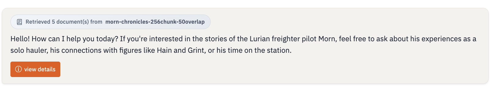
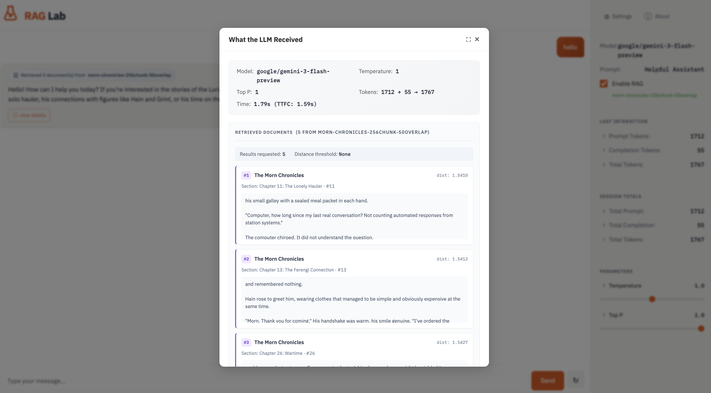

# RAG Lab

[](https://github.com/AlteredCraft/chat-rag-explorer/actions/workflows/test.yml)
[](https://github.com/AlteredCraft/chat-rag-explorer/releases)

Tested on Ubuntu, macOS, and Windows with Python 3.11, 3.12, and 3.13.

An educational application designed to demonstrate the implementation of a Chat interface with Large Language Models (LLMs) and Retrieval-Augmented Generation (RAG). Interested in a RAG workshop for your team? Contact [info@alteredcraft.com](mailto:info@alteredcraft.com). See [past workshop deliveries](https://lu.ma/altered-craft-workshops?k=c&period=past) for examples.

This project uses **Flask** for the backend, **OpenRouter** for LLM access (supporting models like GPT-4, Claude 3, Llama 3, etc.), and **vanilla JavaScript** for a clean, streaming chat interface. The app can start without an API key configured, displaying helpful setup instructions in the UI.

## Prerequisites

*   Python 3.11+
*   [uv](https://github.com/astral-sh/uv) (for package management)
*   An [OpenRouter](https://openrouter.ai/) API Key

## Quick Start

1.  **Clone the repository**
    ```bash
    git clone https://github.com/yourusername/chat-rag-explorer.git
    cd chat-rag-explorer
    uv sync
    uv run pytest
    ```

2.  **Set up the environment variables**
    🛑 If the app is running, first stop it (Ctrl+C).

    ```bash
    cp .env.example .env
    ```
    Edit `.env` and add your API key:
    ```env
    OPENROUTER_API_KEY=sk-or-v1-your-key-here
    ```
    See [Logging Configuration](#logging-configuration) for optional logging settings.

3.  **Run the application**
    ```bash
    uv run main.py
    ```

    > **Port in use?** The app auto-finds an available port (8000-8004).

4.  **Explore**
    Open your browser to [http://127.0.0.1:8000](http://127.0.0.1:8000).

## Features

*   **Inspect Request Details**: Click "view details" on any message to see exactly what the LLM received—model, parameters, token counts, timing, and retrieved RAG documents with their source metadata and similarity scores.

    
    

*   **Real-time Streaming**: Server-Sent Events (SSE) to stream LLM responses token-by-token
*   **Model Selection**: Dynamic model picker with OpenRouter models, filtered to RAG-recommended models via `.models_list`
*   **Conversation History**: Multi-turn conversation support with context retention
*   **Metrics Sidebar**: Real-time session metrics including token usage
*   **Markdown Support**: Secure rendering using Marked.js and DOMPurify (works offline)
*   **Clean UI**: Responsive interface built with vanilla HTML/CSS/JS

## Model Selection

The app filters available OpenRouter models to those listed in `.models_list`. This file contains models that perform well in RAG scenarios. To customize the available models, edit `.models_list`:

```
# One model ID per line, comments start with #
openai/gpt-4.1-mini
anthropic/claude-sonnet-4
google/gemini-2.0-flash-001
```

Delete `.models_list` to show all OpenRouter models (⚠️ hundreds of options, though many not meant for use in chat).

## RAG (Retrieval-Augmented Generation)

RAG integration allows the chat to retrieve relevant documents from ChromaDB and inject them as context for the LLM. See [docs/RAG.md](docs/RAG.md) for detailed documentation.

**Quick Start:**
1. Go to Settings > RAG Settings
2. Configure your ChromaDB connection (local, server, or cloud)
3. Test connection and select a collection
4. Enable RAG toggle in chat sidebar

> **Sample Data Included**: A pre-built ChromaDB with 195 chunks from "The Morn Chronicles" (a Star Trek DS9 fan fiction) is automatically copied to `data/chroma_db/` on first startup. Use path `data/chroma_db` in RAG Settings.

## Content Preparation

To ingest your own documents for RAG retrieval, see the [utils/README.md](utils/README.md) for CLI tools:

- **split.py** - Split large markdown files into chapters by heading pattern
- **ingest.py** - Two-phase workflow: preview chunks → inspect → ingest to ChromaDB

The ingest tool writes human-readable chunk previews to `data/chunks/` so you can tune chunking parameters before committing to the vector database.

---

# Learn More

The sections below provide deeper insight into the application's architecture, testing, logging system, and development roadmap.

## Architecture

### Project Structure

```text
chat-rag-explorer/
├── chat_rag_explorer/           # Main package
│   ├── static/                  # CSS, JS, and local libraries
│   ├── templates/               # HTML templates
│   ├── __init__.py              # App factory
│   ├── logging.py               # Centralized logging configuration
│   ├── routes.py                # Web endpoints
│   ├── services.py              # LLM integration logic
│   ├── rag_config_service.py    # ChromaDB connection management
│   ├── prompt_service.py        # System prompt CRUD operations
│   └── chat_history_service.py  # Conversation logging to JSONL
├── utils/                       # CLI utilities for content preparation
│   ├── README.md                # Utility documentation
│   ├── split.py                 # Split 1 page markdown into chapters
│   └── ingest.py                # Ingest markdown into ChromaDB
├── data/
│   ├── corpus/                  # Source markdown documents
│   ├── chunks/                  # Chunk previews for inspection (gitignored)
│   ├── chroma_db/               # Working ChromaDB databases (gitignored, auto-created)
│   └── chroma_db_sample/        # Pristine sample DB (copied to chroma_db/ on startup)
├── prompts/                     # System prompt templates (markdown)
├── logs/                        # Application logs (gitignored)
├── tests/                       # Test suite
├── config.py                    # Configuration settings (environment variable mapping)
├── main.py                      # Application entry point
├── pyproject.toml               # Dependencies and project metadata (uv)
├── .env.example                 # Template for environment variables (.env)
├── .env                         # Secrets and local overrides (gitignored)
└── .models_list                 # RAG-recommended models filter (see Model Selection)
```

### Design Patterns

*   **Modular Architecture**: Flask Blueprints and Application Factory pattern
*   **Centralized Logging**: Request ID correlation and configurable log levels
*   **Modern Python Tooling**: Uses `uv` for fast dependency management

## Logging

The application features a comprehensive logging system for debugging and monitoring.

### Logging Configuration

Set these environment variables in your `.env` file:

| Variable | Default | Description |
|----------|---------|-------------|
| `LOG_LEVEL_APP` | `DEBUG` | Log level for application code |
| `LOG_LEVEL_DEPS` | `INFO` | Log level for dependencies (Flask, httpx, etc.) |
| `LOG_TO_STDOUT` | `true` | Output logs to console |
| `LOG_TO_FILE` | `true` | Write logs to file |
| `LOG_FILE_PATH` | `logs/app.log` | Path to log file |
| `CHAT_HISTORY_ENABLED` | `false` | Enable chat interaction logging |
| `CHAT_HISTORY_PATH` | `logs/chat-history.jsonl` | Path to chat history file |

### Backend Logging

**Startup Banner**: On application start, logs configuration summary with masked API key:
```
============================================================
RAG Lab - Starting up
============================================================
Configuration:
  - OpenRouter Base URL: https://openrouter.ai/api/v1
  - OpenRouter API Key: sk-or-v1...6a0d
  - Default Model: openai/gpt-3.5-turbo
============================================================
```

**Request Correlation**: All API requests include a unique request ID for tracing:
```
[a1b2c3d4] POST /api/chat - Model: openai/gpt-4, Messages: 3, Content length: 150 chars
[a1b2c3d4] Starting chat stream - Model: openai/gpt-4
[a1b2c3d4] Token usage - Prompt: 45, Completion: 120, Total: 165
[a1b2c3d4] POST /api/chat - Stream completed (1.523s, 42 chunks)
```

**Performance Metrics**: Timing information for requests, including time-to-first-chunk (TTFC) for streams.

### Frontend Logging

The browser console includes structured logs with session tracking:
```
[2025-12-26T15:30:00.000Z] [sess_abc123] INFO: Chat request initiated {model: "openai/gpt-4", messageLength: 50}
[2025-12-26T15:30:01.500Z] [sess_abc123] DEBUG: Time to first chunk {ttfc_ms: "823.45"}
[2025-12-26T15:30:02.000Z] [sess_abc123] INFO: Chat response completed {chunks: 42, totalTime_ms: "1523.00"}
```

Open browser DevTools (F12) -> Console to view frontend logs.

## Testing

The project uses pytest with randomized test ordering to catch hidden state dependencies.

### Running Tests

```bash
uv run pytest                     # Run all tests (randomized order)
uv run pytest -v                  # Verbose output
uv run pytest -x                  # Stop on first failure
uv run pytest --cov               # Run with coverage report
uv run pytest -k "test_name"      # Run specific test by name
```

### Multi-Version Testing

Use [nox](https://nox.thea.codes/) to run tests across Python 3.11, 3.12, and 3.13:

```bash
nox                               # Run on all Python versions
nox -s tests-3.12                 # Run on specific version
nox -- -x                         # Pass args to pytest
```

### Test Philosophy

*   **Unit tests** live in `tests/unit/` and must not make network calls
*   External dependencies (ChromaDB, OpenRouter) are mocked
*   Use `tmp_path` fixture for any file operations
*   Tests run in random order to catch hidden state dependencies

## Release Process

This project uses [Release Please](https://github.com/googleapis/release-please) for automated versioning and changelog generation.

**How it works:**
1. All commits to `main` must use [Conventional Commits](https://www.conventionalcommits.org/) format
2. Release Please automatically creates/updates a Release PR with version bumps and changelog
3. Merge the Release PR when ready to cut a release
4. A GitHub Release and git tag are created automatically

**Commit format:**
| Prefix | Description | Version Bump |
|--------|-------------|--------------|
| `feat:` | New feature | Minor (0.1.0 → 0.2.0) |
| `fix:` | Bug fix | Patch (0.1.0 → 0.1.1) |
| `feat!:` or `fix!:` | Breaking change | Major (0.1.0 → 1.0.0) |
| `docs:` | Documentation | Patch |
| `chore:` | Maintenance | No Release PR triggered, it'll just be part of the next release |

**Examples:**
```bash
git commit -m "feat: add dark mode toggle"
git commit -m "fix: correct token count in sidebar"
git commit -m "feat!: redesign REST API endpoints"
```

## License

This project is open source and available under the [MIT License](LICENSE).
