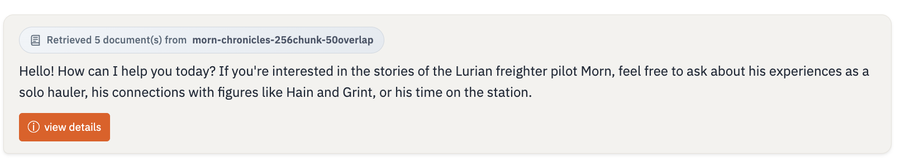
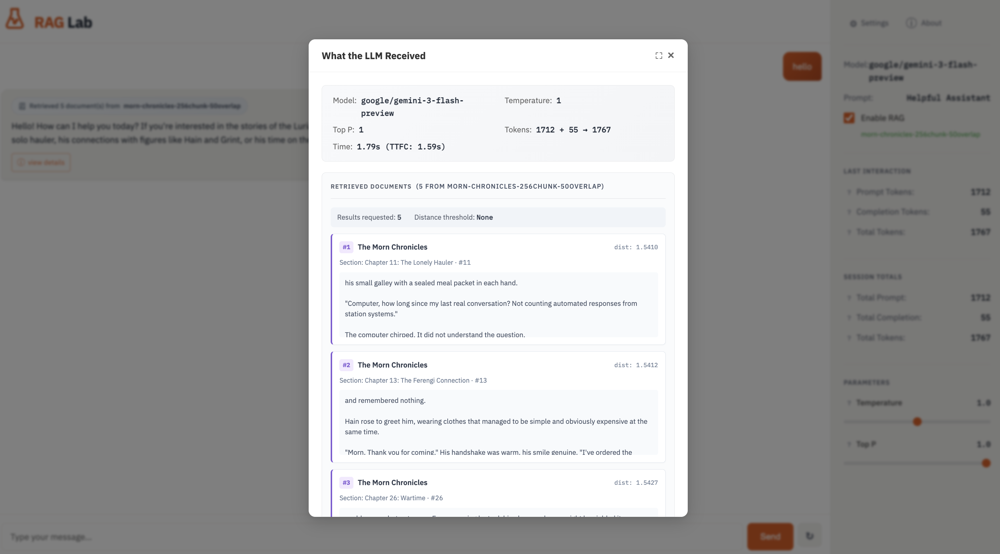

# RAG Lab

[](https://github.com/AlteredCraft/chat-rag-explorer/actions/workflows/test.yml)
[](https://github.com/AlteredCraft/chat-rag-explorer/releases)

A working chat application you can read end to end. It demonstrates two things that are hard to learn from articles alone: how a **streaming** LLM chat interface actually works, and how **Retrieval-Augmented Generation (RAG)** injects your own documents into a model's context.

The stack is deliberately small so the interesting parts stay visible — **Flask** on the backend, **vanilla JavaScript** on the frontend (no build step, no framework), **OpenRouter** (or a local [**Ollama**](#using-ollama-instead-of-openrouter)) for model access, and **ChromaDB** as the vector store.

The most useful feature for learning is **Inspect Request Details**. Click "view details" on any message to see exactly what the model received — the full augmented prompt, the retrieved documents with their similarity scores, token counts, and timing. Most of RAG's behavior becomes obvious once you can see this.




> Interested in a RAG workshop for your team? Contact [info@alteredcraft.com](mailto:info@alteredcraft.com), or see [past workshop deliveries](https://lu.ma/altered-craft-workshops?k=c&period=past). Attending a workshop? Start with [docs/PREWORK.md](docs/PREWORK.md) instead.

## Before you start

| You need | Notes |
|----------|-------|
| [Git](https://git-scm.com/book/en/v2/Getting-Started-Installing-Git) | To clone the repo. No Git? [Download the ZIP](https://github.com/AlteredCraft/chat-rag-explorer/archive/refs/heads/main.zip) instead. |
| [uv](https://docs.astral.sh/uv/getting-started/installation/) | Installs Python and every dependency for you. You do **not** need Python installed first. |
| An [OpenRouter API key](https://openrouter.ai/keys) | One key reaches many models. See [cost](#what-this-costs) below. Prefer not to sign up for anything? Run models locally with [Ollama](#using-ollama-instead-of-openrouter) instead — no key needed. |

You should be comfortable running commands in a terminal. If that's new, start here: [macOS](https://support.apple.com/guide/terminal/welcome/mac) · [Windows](https://learn.microsoft.com/en-us/windows/terminal/) · [Linux](https://documentation.ubuntu.com/desktop/en/latest/tutorial/the-linux-command-line-for-beginners/).

## Get it running

Five steps, start to finish.

**1. Clone the repo and install dependencies**

```bash
git clone https://github.com/AlteredCraft/chat-rag-explorer.git
cd chat-rag-explorer
uv sync
```

`uv sync` reads `pyproject.toml` and `uv.lock`, installs the correct Python version, and builds an isolated environment in `.venv/`. Nothing is installed system-wide.

**2. Confirm the install worked**

```bash
uv run pytest
```

You should see all tests pass. These run entirely offline — no API key and no network needed — so this is a clean check that your environment is sound before any credentials enter the picture.

**3. Add your API key**

```bash
cp .env.example .env
```

Open `.env` and set your provider and key:

```env
LLM_PROVIDER=openrouter
LLM_API_KEY=sk-or-v1-your-key-here
```

Both are required — `LLM_PROVIDER` has no default, so the app asks you to choose rather than assuming. `.env.example` ships with `openrouter` already filled in, so in practice you only edit the key.

The key setting is `LLM_API_KEY`, not a provider-specific name: it holds the key for whichever provider `LLM_PROVIDER` selects. Switching providers changes those two lines and nothing else.

`.env` is gitignored, so your key will not be committed. Every other setting in that file is optional and already has a sensible default.

> Running models locally instead? Skip the key and change `LLM_PROVIDER` to `ollama` — see [Using Ollama instead of OpenRouter](#using-ollama-instead-of-openrouter).

`.env` is read once at startup, so if the app is already running, stop it with `Ctrl+C` and start it again before your key takes effect.

**4. Start the app**

```bash
uv run main.py
```

Leave this running — it's your server. `Ctrl+C` in that terminal stops it.

**5. Open it**

Go to the URL printed in your terminal — [http://127.0.0.1:8000](http://127.0.0.1:8000) unless port 8000 was busy. Type a message and send it; the reply should stream in a word at a time.

You don't need to visit Settings first. A model is already selected for you (see [Model Selection](#model-selection)), so a working key is the only thing standing between a fresh clone and a reply.

To confirm the key is genuinely working, watch that first reply arrive. The model dropdown populating is *not* evidence — OpenRouter's catalog is public, so the picker fills in even with a bad key, and the failure only shows up when you actually send a message.

> The app also starts fine *without* a key and says so in the UI, so you can look around before step 3 if you'd rather.

## Try RAG with the included sample data

The repo ships with a pre-built vector database so you can see retrieval working immediately, without preparing any documents. It holds **429 chunks** drawn from 28 chapters of *The Morn Chronicles*, a Star Trek DS9 fan fiction. Deliberately obscure source material — the model has certainly never seen it, so anything it answers correctly had to come from retrieval rather than memory.

1. Go to **Settings → RAG Settings**
2. Choose **Local** mode. The path dropdown scans `./data/` for databases — pick **📁 chroma_db**
3. Click **Test Connection**, then select the `morn-chronicles-256chunk-50overlap` collection
4. **Save Settings**, return to chat, and switch on **Enable RAG** in the sidebar
5. Ask something only the source would know, such as *"How did Morn get his stool at Quark's bar?"*

Now click **view details** on the answer. You'll see the retrieved chunks, their similarity scores, and the fully assembled prompt. Toggle RAG off and ask the same question again — the difference is the entire point of the exercise.

Once that works, try a question the corpus *can't* answer and watch the similarity scores get worse. Retrieval always returns its best matches, even when the best available match is bad, and recognizing that failure mode is most of what separates a working RAG system from a confidently wrong one.

> **‼️First query is slow.** ChromaDB downloads its embedding model (~79 MB) the first time it embeds anything, then caches it in `~/.cache/chroma`. One-time delay; later queries are fast.

Full details in [docs/RAG.md](docs/RAG.md).

## Try another corpus

The Morn Chronicles is just the one that comes pre-built. `data/corpus/` ships with **seven** document sets in total, all openly licensed, all sitting there as plain markdown waiting to be turned into collections you can switch between.

| Corpus | Files | What it is | Model already knows it? |
|--------|-------|------------|-------------------------|
| `morn_chronicles` | 28 | Star Trek DS9 fan fiction — the pre-built sample | No — invented for this project |
| `autobio_elias_varn` | 20 | An invented 18th-century-style memoir | No — invented for this project |
| `autobio_benjamin_franklin` | 20 | Franklin's autobiography (public domain) | Yes |
| `paul-graham-essays` | 228 | Essays — by far the largest corpus here | Yes |
| `dnd_srd-5.2` | 14 | D&D System Reference Document (CC BY) | Probably |
| `wiki-voyage` | 33 | WikiVoyage city and country guides (CC BY-SA) | Probably |
| `ai_engineer_open_textbooks` | 31 | Open textbook material on AI engineering (CC BY) | Partly |

That last column is the reason to have more than one. The invented corpora **prove** retrieval — the model cannot possibly know Elias Varn, so a correct answer had to come from the documents. The familiar ones show you something harder and more realistic: what retrieval *changes* when the model already has opinions of its own, and how it behaves when the retrieved passage and its training data disagree.

### Enabling one

Takes about a minute.

```bash
% uv run utils/ingest.py
```
This interactive session will take you through chunking and then injesting the data into ChromaDb
```bash
==================================================
Markdown Ingestion - Interactive Mode
==================================================
Press Enter to accept default values.

Available corpus directories:
  [1] ai_engineer_open_textbooks     (31 files, 532.5 KB)
  [2] autobio_benjamin_franklin      (20 files, 349.1 KB)
  [3] autobio_elias_varn             (22 files, 299.1 KB)
  [4] dnd_srd-5.2                    (14 files, 1.5 MB)
  [5] morn_chronicles                (31 files, 433.1 KB)
  [6] paul-graham-essays             (228 files, 3.2 MB)
  [7] wiki-voyage                    (33 files, 2.9 MB)
  [8] Enter a custom path

Enter a directory number:
```

The file counts here are every `.md` in the directory; files starting with `_` are reference material and get skipped at ingestion, which is why `morn_chronicles` lists 31 files but produced 28 chapters' worth of chunks.

Pick a corpus from the numbered list, then press Enter twice to accept the default chunk size and overlap.

1. The tool writes chunk previews to `data/chunks/<corpus>/` and **stops before touching the database**. Open one — it's plain markdown, every chunk labeled with its token count. Worth thirty seconds: seeing where the cuts actually land teaches more about chunking than any explanation.
2. Press `[A]` to accept, then Enter to take the default collection name.
3. Back in **Settings → RAG Settings**, click **Test Connection** again — that's what refreshes the collection list — then pick the new collection and **Save Settings**.

The RAG toggle now searches that corpus. Every collection lives in the same database, so nothing is replaced and switching back is one dropdown change.

> **Try the same corpus twice.** Collections are named `{corpus}-{chunk_size}chunk-{overlap}overlap`, so ingesting one at 256/50 and again at 512/100 leaves you two collections to compare on identical questions. Watching retrieval quality shift with nothing but the chunk boundaries changed is the most instructive experiment in this repo.

Loading your **own** documents works exactly the same way, with a few more steps to prepare the files. [docs/RAG.md](docs/RAG.md#loading-your-own-documents) covers it, including the sharp edges.

## New to these ideas?

You don't need any of this up front — the app runs without it. Reach for these when you hit something you want to understand properly.

| Concept | Where it shows up | Start here |
|---------|-------------------|------------|
| Virtual environments | `uv sync`, the `.venv/` directory | [Python venv tutorial](https://docs.python.org/3/tutorial/venv.html) |
| Flask, routes, blueprints | `chat_rag_explorer/routes.py` | [Flask quickstart](https://flask.palletsprojects.com/en/stable/quickstart/) |
| Streaming HTTP responses | How replies arrive a word at a time | [MDN: Using readable streams](https://developer.mozilla.org/en-US/docs/Web/API/Streams_API/Using_readable_streams) |
| Tokens and context windows | The metrics sidebar, token counts | [OpenRouter docs](https://openrouter.ai/docs) |
| Embeddings | Turning text into vectors for search | [Google ML Crash Course](https://developers.google.com/machine-learning/crash-course/embeddings) |
| Vector databases | ChromaDB, collections, similarity | [Chroma docs](https://docs.trychroma.com/) |
| RAG as a pattern | The whole point of the app | [What is RAG?](https://aws.amazon.com/what-is/retrieval-augmented-generation/) · [docs/RAG.md](docs/RAG.md) |
| Chunking and overlap | `utils/ingest.py` parameters | [utils/README.md](utils/README.md) |
| pytest | `tests/` | [pytest getting started](https://docs.pytest.org/en/stable/getting-started.html) |

## What this costs

OpenRouter is pay-as-you-go, and you are billed per token by whichever model you select. Ordinary experimentation with this app runs to cents, not dollars, but it is not free by default.

Two things worth doing if you're watching your budget. Set a [spending limit](https://openrouter.ai/settings/credits) on your account. And note that OpenRouter offers [free models](https://openrouter.ai/models?max_price=0) — though they won't appear in the picker until you add their IDs to `.models_list`, since that file ships with a curated paid set (see [Model Selection](#model-selection)).

## Platform support

Developed and manually tested on **macOS** — that's the best-supported path and the one to prefer if you have the choice.

Automated tests run in GitHub Actions across **Ubuntu, macOS, and Windows** on **Python 3.11, 3.12, and 3.13** (see [the workflow](.github/workflows/test.yml)). So the Windows test suite is genuinely green, but no one clicks through the running app on Windows before a release. Windows should work; it's just less traveled. If something is off there, that's a real bug and we want to hear about it.

## Getting help

Something broken, unclear, or just wrong? [**Open an issue**](https://github.com/AlteredCraft/chat-rag-explorer/issues) — include your OS, your Python version (`uv run python --version`), and what you expected versus what happened. Documentation gaps are legitimate issues; if you got stuck, the docs failed you.

Workshop attendees can also reach us at [info@alteredcraft.com](mailto:info@alteredcraft.com).

### Common snags

| Symptom | Fix |
|---------|-----|
| `uv: command not found` | Restart your terminal after installing uv so your `PATH` updates. |
| Port already in use | The app tries 8000–8004 automatically. To pin one, set `SERVER_PORT` in `.env`. |
| Models load, but sending a message fails | Expected if the key is bad — the catalog is public, so the picker fills regardless. Diagnose it as a key problem, not a model problem. |
| `401` / `User not found` | The key reached OpenRouter and was rejected. It's invalid, revoked, or belongs to a deleted account — reissue at [openrouter.ai/keys](https://openrouter.ai/keys). A correctly *formatted* key can still be rejected. |
| `402` / insufficient credits | The key is valid but the account is out of funds. [Add credit](https://openrouter.ai/settings/credits) or switch to a free model. |
| Key set but still unauthorized | `.env` is read at startup only. Stop the app with `Ctrl+C` and start it again. |
| "LLM_PROVIDER is not set" | It's required and has no default. Add `LLM_PROVIDER=openrouter` (or `ollama`) to `.env` and restart. An `.env` copied from an older `.env.example` won't have it. |
| Startup says settings are "no longer used" | `OPENROUTER_*`/`OLLAMA_*` keys and URLs were collapsed into `LLM_API_KEY` and `LLM_BASE_URL`. Rename them in `.env`; the old names are ignored. |
| Nothing in the model picker | Every ID in `.models_list` must exist upstream. Compare against [OpenRouter's catalog](https://openrouter.ai/models), or delete the file to show everything. Using Ollama? The file ships with OpenRouter IDs — see [Model Selection](#model-selection). |
| "Could not reach ollama" | Ollama isn't running or the base URL is wrong. Start it with `ollama serve`, or check `LLM_BASE_URL` in `.env`. |
| First RAG query hangs | It's downloading the ~79 MB embedding model. Let it finish once. |
| "No databases found" in the path dropdown | The dropdown lists `./data/*` directories containing a `chroma.sqlite3`. Start the app at least once — it creates `data/chroma_db` on first run. |
| Newly ingested collection isn't in the list | The collection dropdown is populated by **Test Connection**. Click it again after ingesting. |
| Re-ingested edited documents, nothing changed | Chunk IDs collide with the ones already stored and ChromaDB keeps the old text. Ingest under a new collection name. |

---

# Learn More

Deeper reference on architecture, testing, logging, and the release process.

## Features

*   **Inspect Request Details**: See the exact payload sent to the model — parameters, token counts, timing, and retrieved RAG documents with source metadata and similarity scores
*   **Real-time Streaming**: replies arrive over a chunked HTTP response, read incrementally in the browser with the Streams API (`chat_rag_explorer/routes.py`, `static/script.js`)
*   **Model Selection**: Model picker populated from the active provider (OpenRouter or Ollama), filtered by `.models_list`
*   **Conversation History**: Multi-turn conversations with context retention
*   **Metrics Sidebar**: Live session metrics including token usage
*   **Markdown Support**: Secure rendering via Marked.js and DOMPurify (bundled locally, works offline)
*   **Clean UI**: Responsive interface in vanilla HTML/CSS/JS

## Model Selection

Two separate things decide which model a request uses: `.models_list` controls **which models are offered**, and `DEFAULT_MODEL` controls **which one is chosen when the user hasn't picked**.

### `.models_list` — what appears in the picker

OpenRouter exposes hundreds of models, many of them unsuited to chat. This file narrows the picker to a curated set that behaves well in RAG scenarios. Edit it to customize:

```
# One model ID per line, comments start with #
openai/gpt-5.6-luna
anthropic/claude-sonnet-4.5
google/gemini-3.6-flash
```

Blank lines and `#` comments are ignored. Browse [OpenRouter's catalog](https://openrouter.ai/models) for valid IDs — an ID that doesn't exist upstream simply won't appear.

Delete the file entirely to show every model the active provider offers (⚠️ hundreds of entries on OpenRouter). The Settings page reports whether the filter is active and how many models it lists.

The filter treats model IDs as opaque strings, so it works for any provider — with Ollama the IDs are the model names you've pulled, like `llama3.2:3b`. Note that the file ships with OpenRouter IDs, so if you switch to Ollama, either replace them with your Ollama model names or delete the file (an Ollama install offers few enough models that the unfiltered picker stays manageable).

### `DEFAULT_MODEL` — what's selected before the user chooses

The default is declared once, in `config.py` (override it with the `DEFAULT_MODEL` environment variable). The frontend fetches it from `/api/status` on page load, so the chat page and the Settings picker always agree with the backend — there is nothing to keep in sync by hand.

Keep the default present in `.models_list` or it won't be selectable; `tests/unit/test_config.py` enforces that rule, so drift fails the suite rather than surfacing as a confusing runtime error.

> **Changed the default and nothing happened?** Your model choice is remembered in `localStorage` under `chat-rag-selected-model`, and a saved choice always wins over the default. To see the new default, pick a different model in Settings, or clear site data in your browser's DevTools (Application → Local Storage).

## Using Ollama instead of OpenRouter

Everything the app sends to a model goes through the OpenAI-compatible chat completions API, so it can just as easily talk to [Ollama](https://ollama.com) — either a local install (free, private, no sign-up) or Ollama's cloud service.

### Local Ollama

1. [Install Ollama](https://ollama.com/download) and pull a model, e.g. `ollama pull llama3.2:3b`
2. Make sure it's running (`ollama serve` if it isn't already)
3. In `.env`, select the provider and a default model you've pulled, and clear the key:

```env
LLM_PROVIDER=ollama
LLM_API_KEY=
DEFAULT_MODEL=llama3.2:3b
```

4. Make the model selectable: add its name to `.models_list`, or delete that file to show everything Ollama offers (see [Model Selection](#model-selection))
5. Restart the app

You don't need `LLM_BASE_URL` — with `LLM_PROVIDER=ollama` it defaults to `http://localhost:11434/v1`. No API key is involved either; the app fills in a placeholder because the OpenAI SDK insists on one, and Ollama ignores it.

### Ollama cloud

Same as above, plus point the base URL at the cloud endpoint and set your [Ollama API key](https://ollama.com/settings/keys):

```env
LLM_PROVIDER=ollama
LLM_BASE_URL=https://ollama.com/v1
LLM_API_KEY=your-ollama-key-here
DEFAULT_MODEL=gpt-oss:120b
```

### What to expect in the picker

Ollama's model listing reports only IDs — no display names, context lengths, or prices — so the Settings page shows the ID as the name, `N/A` for context length, and treats every model as free. Model IDs without a `/` also group under a single "Other" heading rather than by vendor. All cosmetic; chat, streaming, and RAG behave identically.

## Content Preparation

Two CLI tools prepare markdown for ingestion. Full reference in [utils/README.md](utils/README.md); the workflow and its sharp edges are in [docs/RAG.md](docs/RAG.md#loading-your-own-documents).

- **`utils/split.py`** — split one large markdown file into chapters by heading pattern
- **`utils/ingest.py`** — preview chunks → inspect → ingest to ChromaDB

Both write into `data/chroma_db`, the same database the app reads, so ingested collections appear alongside the shipped sample rather than replacing it.

## Architecture

### Project Structure

```text
chat-rag-explorer/
├── chat_rag_explorer/           # Main package
│   ├── static/                  # CSS, JS, and local libraries
│   ├── templates/               # HTML templates
│   ├── __init__.py              # App factory
│   ├── logging.py               # Centralized logging configuration
│   ├── routes.py                # Web endpoints
│   ├── services.py              # LLM integration logic
│   ├── providers.py             # Provider seam (OpenRouter / Ollama)
│   ├── rag_config_service.py    # ChromaDB connection management
│   ├── prompt_service.py        # System prompt CRUD operations
│   ├── chat_history_service.py  # Conversation logging to JSONL
│   ├── error_messages.py        # User-facing misconfiguration messages
│   └── utils.py                 # Request IDs, API key masking
├── utils/                       # CLI utilities for content preparation
│   ├── README.md                # Utility documentation
│   ├── split.py                 # Split 1 page markdown into chapters
│   └── ingest.py                # Ingest markdown into ChromaDB
├── data/
│   ├── corpus/                  # Source markdown documents
│   ├── chunks/                  # Chunk previews for inspection (gitignored)
│   ├── chroma_db/               # Working ChromaDB databases (gitignored, auto-created)
│   └── chroma_db_sample/        # Pristine sample DB (copied to chroma_db/ on startup)
├── docs/                        # RAG reference, workshop prework
├── prompts/                     # System prompt templates (markdown)
├── logs/                        # Application logs (gitignored)
├── tests/                       # Test suite
├── config.py                    # Configuration settings (environment variable mapping)
├── main.py                      # Application entry point
├── pyproject.toml               # Dependencies and project metadata (uv)
├── .env.example                 # Template for environment variables (.env)
├── .env                         # Secrets and local overrides (gitignored)
└── .models_list                 # RAG-recommended models filter (see Model Selection)
```

### Design Patterns

*   **Modular Architecture**: Flask [Blueprints](https://flask.palletsprojects.com/en/stable/blueprints/) and the [Application Factory](https://flask.palletsprojects.com/en/stable/patterns/appfactories/) pattern
*   **Centralized Logging**: Request ID correlation and configurable log levels
*   **Modern Python Tooling**: `uv` for dependency management

## Configuration

All settings live in `.env` (copied from `.env.example`). Two are required: `LLM_PROVIDER`, and — unless you're on a local Ollama — `LLM_API_KEY`.

Connection settings are **provider-agnostic**. There is one `LLM_API_KEY` and one `LLM_BASE_URL`, applying to whichever provider `LLM_PROVIDER` selects, rather than an `OPENROUTER_*` and `OLLAMA_*` pair each. Switching providers therefore can't leave a stale setting from the other one shadowing your change.

`LLM_PROVIDER` deliberately has no default in code. Defaulting it would let someone who never made the choice end up on OpenRouter and then be puzzled by the API key errors, so the app reports an unset value at startup and in the UI instead.

`LLM_BASE_URL` does have a default, but a *per-provider* one — `openrouter` resolves to OpenRouter's endpoint, `ollama` to `http://localhost:11434/v1`. Set it only to reach somewhere else, such as Ollama cloud. Because the fallback follows the provider, the endpoint can never disagree with your provider choice.

| Variable | Default | Description |
|----------|---------|-------------|
| `LLM_PROVIDER` | — | **Required.** Which provider serves chat: `openrouter` or `ollama` |
| `LLM_API_KEY` | — | **Required** except on a local Ollama. Key for the selected provider |
| `LLM_BASE_URL` | per provider (see above) | Endpoint for the selected provider; set for Ollama cloud |
| `CHROMADB_API_KEY` | — | Only for ChromaDB cloud mode |
| `SERVER_HOST` | `127.0.0.1` | Bind address |
| `SERVER_PORT` | `8000` | Starting port |
| `SERVER_PORT_RETRIES` | `5` | How many ports to try (8000–8004) |
| `LOG_LEVEL_APP` | `DEBUG` | Log level for application code |
| `LOG_LEVEL_DEPS` | `INFO` | Log level for dependencies (Flask, httpx, etc.) |
| `LOG_TO_STDOUT` | `true` | Output logs to console |
| `LOG_TO_FILE` | `true` | Write logs to file |
| `LOG_FILE_PATH` | `logs/app.log` | Path to log file |
| `CHAT_HISTORY_ENABLED` | `false` | Enable chat interaction logging |
| `CHAT_HISTORY_PATH` | `logs/chat-history.jsonl` | Path to chat history file |

## Logging

### Backend

**Startup Banner**: on start, logs a configuration summary with the API key masked:

```
============================================================
RAG Lab - Starting up
============================================================
Configuration:
  - LLM Provider: openrouter
  - Base URL: https://openrouter.ai/api/v1
  - API Key: sk-or-v1...6a0d
  - Default Model: deepseek/deepseek-v4-flash
============================================================
```

**Request Correlation**: every API request carries a unique 8-character request ID, so you can follow one request through the whole log:

```
[a1b2c3d4] POST /api/chat - Model: openai/gpt-4, Messages: 3, Content length: 150 chars
[a1b2c3d4] Starting chat stream - Model: openai/gpt-4
[a1b2c3d4] Token usage - Prompt: 45, Completion: 120, Total: 165
[a1b2c3d4] POST /api/chat - Stream completed (1.523s, 42 chunks)
```

**Performance Metrics**: timing for requests, including time-to-first-chunk (TTFC) for streams.

### Frontend

The browser console carries structured logs with session tracking:

```
[2025-12-26T15:30:00.000Z] [sess_abc123] INFO: Chat request initiated {model: "openai/gpt-4", messageLength: 50}
[2025-12-26T15:30:01.500Z] [sess_abc123] DEBUG: Time to first chunk {ttfc_ms: "823.45"}
[2025-12-26T15:30:02.000Z] [sess_abc123] INFO: Chat response completed {chunks: 42, totalTime_ms: "1523.00"}
```

Open DevTools ([F12](https://developer.chrome.com/docs/devtools/open)) → Console to view them.

## Testing

pytest with randomized test ordering, to catch tests that secretly depend on each other.

```bash
uv run pytest                     # Run all tests (randomized order)
uv run pytest -v                  # Verbose output
uv run pytest -x                  # Stop on first failure
uv run pytest --cov               # Run with coverage report
uv run pytest -k "test_name"      # Run a specific test by name
```

### Multi-Version Testing

[nox](https://nox.thea.codes/) runs the suite across Python 3.11, 3.12, and 3.13 — the same versions CI uses:

```bash
uv run nox                        # Run on all Python versions
uv run nox -s tests-3.12          # Run on a specific version
uv run nox -- -x                  # Pass args through to pytest
```

### Test Philosophy

*   **Unit tests** live in `tests/unit/` and must not make network calls
*   External dependencies (ChromaDB, OpenRouter) are mocked
*   Use the `tmp_path` fixture for file operations
*   Tests run in random order to surface hidden state dependencies

## Release Process

This project uses [Release Please](https://github.com/googleapis/release-please) for automated versioning and changelog generation.

**How it works:**
1. All commits to `main` use [Conventional Commits](https://www.conventionalcommits.org/) format
2. Release Please opens or updates a Release PR with the version bump and changelog
3. Merge the Release PR to cut a release
4. A GitHub Release and git tag are created automatically

**Commit format:**

| Prefix | Description | Version Bump |
|--------|-------------|--------------|
| `feat:` | New feature | Minor (0.1.0 → 0.2.0) |
| `fix:` | Bug fix | Patch (0.1.0 → 0.1.1) |
| `feat!:` or `fix!:` | Breaking change | Major (0.1.0 → 1.0.0) |
| `docs:` | Documentation | Patch |
| `chore:` | Maintenance | No Release PR triggered; rolls into the next release |

```bash
git commit -m "feat: add dark mode toggle"
git commit -m "fix: correct token count in sidebar"
git commit -m "feat!: redesign REST API endpoints"
```

## License

Open source under the [MIT License](LICENSE).
